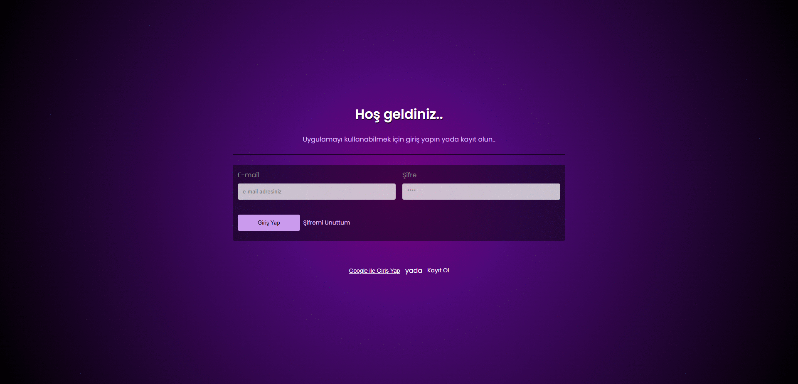

## React + Firebase ile Hazırlanan Todo Uygulaması

Bu uygulama, her kullanıcının kişiselleştirilebilir bir profil sayfası olan ve günlük görevlerini kolayca organize edebileceği bir uygulamadır.

Demo: #

---

### Özellikler

- **Kullanıcı Kaydı ve Girişi:** Yeni kullanıcılar kayıt olabilir ve mevcut kullanıcılar oturum açabilir.
- **Kullanıcı Profil Sayfası Düzenlemeleri:** Kullanıcılar profil resimlerini, isimlerini ve şifreleri gibi bilgilerini değiştirebilir.
- **Görev Ekleme, tamamlama ve silme:** Kullanıcı yeni görevler ekleyebilir, eklediğini görevleri tamamladım butonu ile işaretleyebilir ve silme butonu ile silebilir.

---

### Kullandığım Teknolojiler:

- React + Vite.
- React Router DOM.
- Firebase.

---

### Kurulum ve Kullanım:

- **Adım 1: Klonlama:** `git clone https://github.com/gokhandemr/react-firebase-todo-app.git`
- **Adım 2: Proje Klasörünü Açma:** `cd react-firebase-todo-app`
- **Adım 3: Npm Yükleme:** `npm install`
- **Adım 4: Çalıştırma:** `npm run dev`

---

### İletişim

_gkhandemir96@gmail.com_